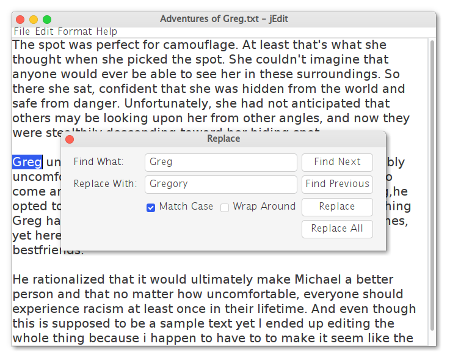

#  jEdit v.1.0 (alpha)

 jEdit: A sweet and simple text editor in Java

## Features

* Create and save files
* Open existing file
* Print a file
* Find & Replace
* Undo/Redo Support (beta)
* Basic text formatting

## Build

Run the file `build.sh` 
